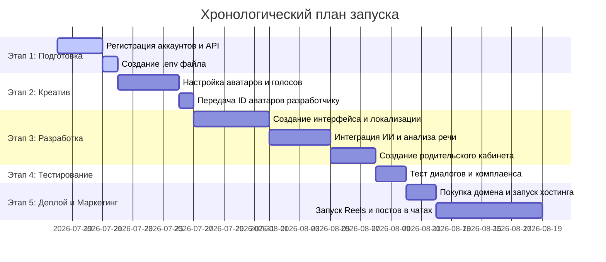

# Дорожная карта проекта: Детская языковая школа словацкого языка

Этот документ содержит пошаговый хронологический план действий для Игоря (основатель) и Antigravity (ИИ-разработчик) по запуску детской интерактивной площадки.

---

## 🗺️ Этапы реализации проекта



---

## 👤 Подробная инструкция для Игоря (Пошаговые действия)

### Шаг 1: Регистрация технических аккаунтов и получение API-ключей
1. **OpenAI API (для диалогов и модерации)**:
   * Перейдите на [platform.openai.com](https://platform.openai.com/) и зарегистрируйте аккаунт разработчика.
   * Пополните баланс (для старта и тестов достаточно 5–10$).
   * Перейдите в раздел **API Keys**, нажмите **Create new secret key**, скопируйте его и сохраните в надежном месте (больше вы его не увидите на сайте).
2. **HeyGen Developer (для видео-аватаров)**:
   * Перейдите на [heygen.com](https://www.heygen.com/) в кабинет разработчика.
   * Получите ваш **HeyGen API Key**.
3. **Azure Cognitive Services или SpeechAce (для анализа произношения)**:
   * Зарегистрируйтесь на портале [Azure Portal](https://portal.azure.com/) и создайте ресурс **Speech service** (у них есть бесплатный лимит на распознавание речи).
   * Скопируйте **Azure Speech API Key** и **Region** (например, `westeurope`).

### Шаг 2: Создание файла конфигурации безопасности
1. Откройте корневую папку нашего проекта на вашем компьютере.
2. Создайте файл с именем **`.env`** (убедитесь, что расширение `.txt` отсутствует).
3. Запишите в него полученные ключи в следующем формате:
   ```env
   OPENAI_API_KEY=ваш_ключ_openai
   HEYGEN_API_KEY=ваш_ключ_heygen
   AZURE_SPEECH_KEY=ваш_ключ_azure
   AZURE_SPEECH_REGION=ваш_регион_azure
   ```
4. Сохраните файл. После этого я смогу считывать эти ключи для сборки кода.

### Шаг 3: Настройка персонажей-аватаров в кабинете HeyGen
1. **Люди в вышиванках**: Выберите подходящего человека-аватара из библиотеки HeyGen, задайте ему одежду.
2. **Животные (Маскоты)**: Загрузите сгенерированное высококачественное изображение волка.
3. **Голоса**: Клонируйте свой голос или выберите готовые профессиональные голоса для украинской озвучки и словацкого произношения.
4. **Получение ID**:
   * Скопируйте текстовые **Avatar ID** и **Voice ID** для каждого персонажа.
   * Передайте эти ID мне (просто напишите их в чате), чтобы я встроил их в плеер WebRTC на сайте.

### Шаг 4: Тестирование готового MVP (После того как я закончу кодить)
1. Я соберу интерфейс и бэкенд-логику. Вы откроете тестовую версию сайта.
2. Попробуйте поговорить с аватаром на словацком языке:
   * Совершите ошибки в произношении и посмотрите, как система указывает на них.
   * Попробуйте написать в чат запрещенное слово или фразу, чтобы проверить работу системных фильтров безопасности (Guardrails).
3. Проверьте отображение статистики в родительском кабинете.

### Шаг 5: Покупка домена, деплой и старт маркетинга
1. Зарегистрируйте домен (например, `noviydim.com` или `susidmova.com`) на Namecheap или Websupport.
2. Мы выгрузим код на хостинг (я помогу настроить автоматический деплой через GitHub на Vercel или Render).
3. Создайте 3-4 тестовых видео Reels/TikTok с волком Влком и выложите их с призывом переходить на сайт.
4. Опубликуйте первый полезный пост в родительских чатах Словакии с лид-магнитом на бесплатный тренажер.

---

## 🛠️ Роль Antigravity (Что я делаю параллельно вашим шагам)

* **Пока вы делаете Шаги 1 и 2**: Я подготавливаю структуру файлов детской школы в папке `детская языковая школа` и прописываю каркас мультиязычной верстки (UA/RU).
* **Пока вы делаете Шаг 3**: Я пишу JavaScript-код интеграции с WebRTC-стримингом HeyGen и подключаю библиотеку анализа произношения от Azure/SpeechAce.
* **Пока вы делаете Шаг 4**: Я реализую дизайн и функционал родительского дашборда с графиками успеваемости.
* **После тестирования**: Я упаковываю готовый проект в ZIP-архив и готовлю инструкции для выгрузки на выбранный вами хостинг.
