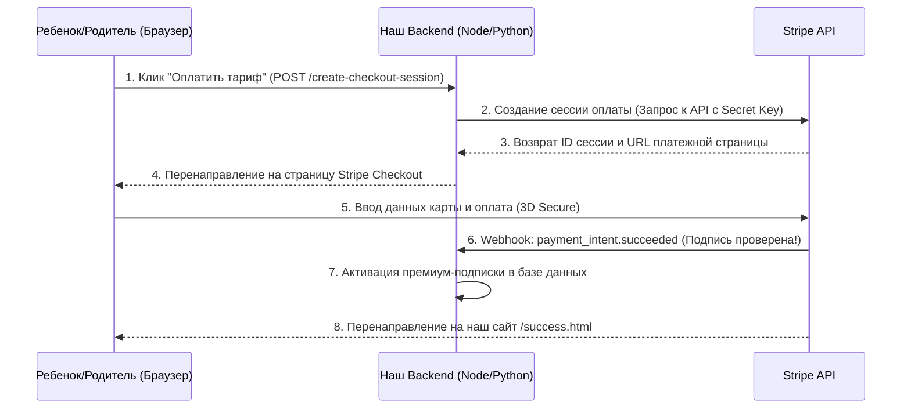

# Интеграция платежной системы Stripe: Безопасность, Регистрация и Подключение

Для проекта детской языковой школы в Словакии (и более широкого маркетплейса) необходима современная платежная система, которая обеспечивает прием банковских карт (Visa, Mastercard), а также локальных европейских методов (SEPA, Apple Pay, Google Pay).

---

## 1. Сравнение и выбор платежной системы

Ниже приведено сравнение популярных платежных шлюзов по ключевым критериям безопасности, надежности и простоты регистрации:

| Критерий | Stripe (Рекомендуется) | PayPal / Braintree | Adyen | Fondy |
| :--- | :--- | :--- | :--- | :--- |
| **Безопасность** | **Экстремальная** (PCI-DSS Level 1, встроенный ИИ-антифрод Radar, 3D Secure 2) | Высокая | Высокая | Средняя |
| **Надежность (Uptime)** | **>99.99%** | >99.9% | >99.99% | >99.8% |
| **Простота регистрации в EU** | **Очень простая** (Полностью онлайн за 15 минут для компаний и ИП/Živnosť) | Средняя (Требует много ручных документов) | Сложная (Ориентирована на крупный Enterprise) | Средняя (Могут возникнуть сложности с регуляцией в ЕС) |
| **Сложность интеграции** | **Минимальная** (Лучшая в мире документация, готовые виджеты Stripe Checkout) | Средняя | Высокая | Средняя |

> [!IMPORTANT]
> **Выбор: Stripe**
> Stripe является золотым стандартом для онлайн-бизнеса в Евросоюзе (включая Словакию). Он позволяет принимать платежи напрямую на сайте без перенаправления пользователя на сторонние подозрительные страницы, поддерживает Apple/Google Pay «из коробки» и имеет простейшую процедуру KYC/KYB.

---

## 2. Безопасность и соответствие стандартам (PCI-DSS)

При интеграции платежей крайне важно соблюдать правила безопасности данных платежных карт.

> [!CAUTION]
> **Никогда не сохраняйте и не передавайте сырые данные банковских карт (номер, срок действия, CVV) через свои сервера!**
> Это является грубейшим нарушением стандарта безопасности **PCI-DSS** и влечет за собой огромные штрафы и блокировку счетов.

### Как Stripe решает эту проблему:
1. **Stripe Elements / Stripe Checkout**: Поля ввода карт рендерятся внутри защищенных iframe-контейнеров, размещенных непосредственно на серверах Stripe. Данные карты пользователя передаются напрямую в Stripe, минуя ваш сервер.
2. **Токенизация**: Ваш сервер получает только безопасный одноразовый токен платежа (`tok_xxxx` или `pi_xxxx`), который вы используете для завершения транзакции.
3. **Безопасность Webhooks**: Все уведомления от Stripe о статусе оплаты подписываются секретным ключом. При получении вебхука ваш сервер должен проверять сигнатуру (`Stripe-Signature`), чтобы предотвратить симуляцию успешной оплаты злоумышленниками.

---

## 3. Пошаговая инструкция по регистрации в Stripe

Для регистрации аккаунта Stripe для бизнеса в Словакии (Živnosť или S.R.O.) выполните следующие шаги:

### Шаг 3.1. Подготовка документов
Перед началом регистрации подготовьте:
- **Данные юридического лица/ИП**:
  - Идентификационный номер (IČO).
  - Налоговый номер (DIČ) и VAT-номер (IČ DPH), если применимо.
  - Юридический адрес в Словакии.
- **Данные представителя**:
  - Загранпаспорт или ID-карта (для подтверждения личности).
  - Подтверждение адреса проживания (выписка из банка или коммунальный счет не старше 3 месяцев).
- **Банковские реквизиты**:
  - IBAN европейского банковского счета (в EUR) для вывода средств.
- **Сайт проекта**:
  - Сайт должен работать по протоколу HTTPS.
  - На сайте должны быть размещены: Пользовательское соглашение (Terms of Service), Политика конфиденциальности (Privacy Policy / GDPR) и Условия возврата средств (Refund Policy).

### Шаг 3.2. Создание аккаунта
1. Перейдите на [Stripe Register](https://dashboard.stripe.com/register).
2. Введите ваш email, имя и выберите страну **Словакия** (Slovakia).
3. Подтвердите ваш email, кликнув по ссылке в письме.

### Шаг 3.3. Активация платежей (KYC / KYB)
1. В панели управления Stripe нажмите **"Activate payments"**.
2. **Тип бизнеса (Business structure)**: выберите *Individual/Sole Proprietor* (для Živnosť) или *Company* (для S.R.O. / ООО).
3. **Данные бизнеса**: введите IČO, адрес и вид деятельности (например, *Education / Software*).
4. **Персональные данные**: введите имя, дату рождения, словацкий адрес проживания и номер телефона.
5. **Верификация личности**: загрузите скан загранпаспорта/ID-карты и селфи (для автоматической проверки).
6. **Вывод средств (Payouts)**: введите ваш словацкий IBAN.
7. **Описание для выписки (Statement descriptor)**: укажите короткое имя, которое клиенты увидят в банковской выписке (например, `SLOVAHOJ-KIDS`).

Проверка документов обычно занимает от 10 минут до 24 часов. После этого ваш аккаунт перейдет в статус **Active**, и вы сможете принимать реальные деньги.

---

## 4. Технические шаги по подключению Stripe Checkout

Самый простой, безопасный и быстрый способ интеграции — **Stripe Checkout** (готовая защищенная платежная страница, размещенная на стороне Stripe).



### Подключение в 3 шага:

1. **Получение API-ключей**:
   В панели Stripe перейдите в раздел **Developers -> API keys**. Вы получите два ключа:
   - `Publishable key` (публичный, начинается на `pk_live_...`) — используется на фронтенде.
   - `Secret key` (секретный, начинается на `sk_live_...`) — хранится **только** на бэкенде.

2. **Создание сессии оплаты на сервере**:
   При клике на тариф ваш бэкенд делает запрос к Stripe:
   ```javascript
   const stripe = require('stripe')(process.env.STRIPE_SECRET_KEY);

   const session = await stripe.checkout.sessions.create({
     payment_method_types: ['card', 'sepa_debit'],
     line_items: [{
       price: 'price_12345...', // ID продукта, созданного в панели Stripe
       quantity: 1,
     }],
     mode: 'subscription', // или 'payment' для разовой оплаты
     success_url: 'https://mysite.com/success.html',
     cancel_url: 'https://mysite.com/cancel.html',
   });
   
   // Возвращаем URL сессии для перенаправления
   res.json({ url: session.url });
   ```

3. **Обработка успешной оплаты через Webhooks**:
   На сервере настраивается endpoint для получения уведомлений от Stripe:
   ```javascript
   const endpointSecret = process.env.STRIPE_WEBHOOK_SECRET;

   app.post('/webhook', express.raw({type: 'application/json'}), (req, res) => {
     const sig = req.headers['stripe-signature'];
     let event;

     try {
       event = stripe.webhooks.constructEvent(req.body, sig, endpointSecret);
     } catch (err) {
       return res.status(400).send(`Webhook Error: ${err.message}`);
     }

     if (event.type === 'checkout.session.completed') {
       const session = event.data.object;
       // Метод для выдачи доступа пользователю
       activateUserSubscription(session.customer_email);
     }

     res.json({received: true});
   });
   ```

---

## 5. Домен и режим тестирования (Test Mode vs Live Mode)

> [!TIP]
> **Разработка без домена возможна!**
> Вам **не нужно** ждать покупки и привязки домена, чтобы начать разработку и тестирование платежей. Stripe позволяет полностью настроить и проверить весь процесс в тестовом режиме.

### Сравнение этапов работы:

1. **Этап разработки (Тестовый режим / Test Mode):**
   - Вы можете зарегистрировать аккаунт в Stripe прямо сейчас.
   - Подтверждение сайта и документов **не требуется** для тестовых платежей.
   - Используются тестовые ключи: `pk_test_...` и `sk_test_...`.
   - Оплаты имитируются с помощью тестовых карт (например, карта `4242 4242 4242 4242` с любым сроком действия и CVV).
   - Вы можете полностью протестировать работу бэкенда, БД и вебхуков локально.

2. **Этап запуска (Рабочий режим / Live Mode):**
   - **Домен обязателен.** Перед активацией Live-режима вы должны выложить сайт на реальный домен (например, `mysite.sk`).
   - На сайте **обязательно** должны быть заполнены страницы:
     - Политика конфиденциальности (Privacy Policy / GDPR).
     - Условия использования (Terms of Service).
     - Правила возврата средств (Refund & Cancelation Policy).
     - Контакты компании (юридическое название, адрес, IČO, email).
   - Подключается SSL-сертификат (**HTTPS**). Stripe блокирует транзакции через небезопасный протокол HTTP.
   - Вы нажимаете *"Activate payments"* в Stripe, вводите адрес сайта и данные компании, после чего заменяете ключи в коде на боевые (`pk_live_...` и `sk_live_...`).
