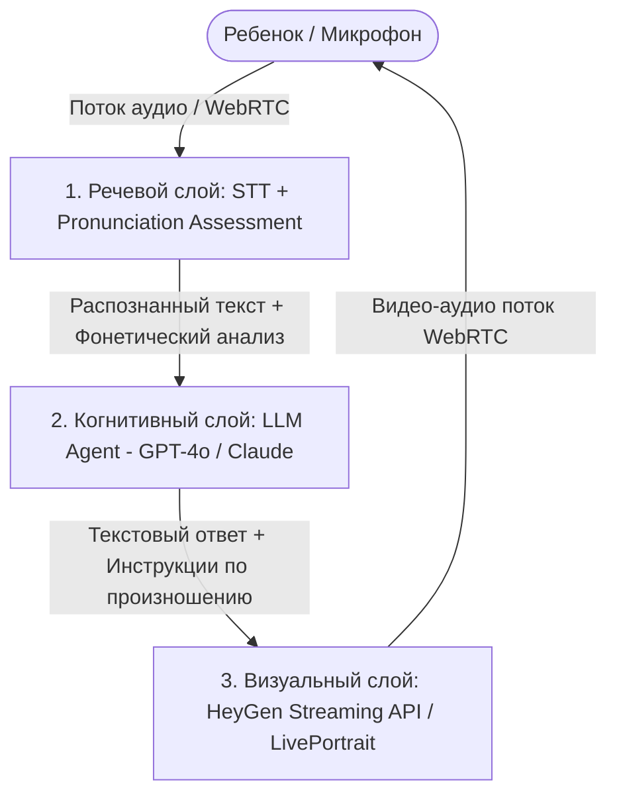

# Технический план реализации детской игровой языковой площадки

Этот документ содержит детальную техническую архитектуру, перечень инструментов и план реализации детского направления языковой школы (до 14 лет) в Словакии, ориентированного на детей из Украины.

---

## 1. Позиционирование и маркетинг
* **Цель площадки**: Игровая адаптация, социализация и изучение словацкого языка для украинских детей до 14 лет (как находящихся в Украине перед переездом, так и уже живущих в Словакии).
* **Локализация**: Язык интерфейса по умолчанию — украинский, с возможностью мгновенного переключения на русский в шапке сайта.
* **Маркетинговый фокус**: Продукт продается родителям. Вся коммуникация на лендинге подчеркивает снижение стресса ребенка при адаптации, подготовку к местной школе/детскому саду, безопасность общения и измеримый контроль результатов через родительский дашборд.

---

## 2. Архитектура интерактивных ИИ-учителей

Для создания живых интерактивных аватаров (реалистичных животных и людей в украинской национальной одежде), способных вести живой диалог, подсказывать грамматику и анализировать произношение, используется трехслойная ИИ-архитектура:

### Слой 1: Визуальный (Интерактивные аватары)
* **Инструменты**: 
  * **HeyGen Interactive Avatar API (Streaming)** — для рендеринга людей в вышиванках в реальном времени с задержкой до 1.5 секунд через WebRTC.
  * **LivePortrait / SadTalker + WebRTC** — для анимирования реалистичных животных (например, волка Влка). Мы берем 3D/2D изображение животного и накладываем генерируемый мимический поток (lip-sync) на пасть.
  * **Luma Dream Machine / Runway Gen-2** — для создания коротких фоновых эмоциональных реакций маскота (радость при правильном ответе, поддержка при ошибке).

### Слой 2: Когнитивный (Диалог и грамматика)
* **Инструменты**: **GPT-4o (OpenAI API)** или **Claude 3.5 Sonnet (Anthropic)**.
* **Принцип реализации**: Создаются ИИ-агенты с системным промптом «детского словацкого педагога».
  * *Роль*: Аватар не просто отвечает, он вовлекает ребенка в игру («Давай представим, что мы в словацком магазине. Попробуй попросить у меня мороженое»).
  * *Коррекция*: Мягко исправляет грамматические и стилистические ошибки, хвалит за попытки, переводит сложные слова на украинский/русский при необходимости.

### Слой 3: Речевой (Анализ произношения на уровне фонем)
* **Инструменты**:
  * **SpeechAce API** или **Microsoft Azure Speech Pronunciation Assessment**.
  * **Google Cloud Speech-to-Text** (с поддержкой фонетического анализа).
* **Принцип реализации**: 
  1. Ребенок говорит фразу на словацком в микрофон.
  2. Аудиопоток отправляется на SpeechAce/Azure API.
  3. API возвращает оценку произношения (*Pronunciation Score*), а также указывает, в каких конкретно слогах или буквах (например, словацкие дифтонги **ô**, **ia**, **ie** или твердые/мягкие согласные **ľ**, **ň**, **ť**) ребенок допустил ошибку.
  4. Аватар озвучивает подсказку: *«Почти получилось! Но попробуй произнести букву 'ô' как короткое 'уо'. Давай вместе: kôň!»*

---

## 3. Родительский кабинет (Дашборд контроля)

Родительский кабинет решает главную боль родителя — контроль полезности времени, проведенного ребенком за экраном.

### Функционал кабинета:
1. **Экран активности (Статистика посещений)**:
   * График времени, проведенного на платформе по дням/неделям.
   * Количество завершенных игровых сценариев.
2. **Словарь прогресса**:
   * Список выученных ребенком словацких слов с индикацией уровня их освоения (активный или пассивный запас).
3. **Карта адаптации и социализации**:
   * Метрика прохождения практических сценариев: «Ребенок умеет познакомиться на детской площадке», «Ребенок может попросить о помощи», «Ребенок понимает указания учителя в словацкой школе».
4. **Фонетический отчет**:
   * Анализ звуков словацкого языка, которые даются ребенку сложнее всего, с рекомендациями по тренировке дома.

### Технологический стек дашборда:
* **Frontend**: Vanilla JS (или React/Vite при расширении), графики на **Chart.js** или **Recharts**.
* **Backend**: **Node.js (Express)** или **Python (FastAPI)** для расчета статистики и сохранения прогресса.
* **База данных**: **PostgreSQL** для профилей пользователей и **MongoDB** для детальных логов диалогов и фонетических оценок.

---

## 4. Соблюдение требований ЕС (Compliance: GDPR-K и AI Act)

Работа ИИ-аватаров с детьми до 14 лет в Евросоюзе жестко регулируется:

1. **GDPR-K (Защита детских данных)**:
   * **Двойное согласие родителей (Double Opt-In)**: Регистрация аккаунта ребенка невозможна без верификации личности и согласия родителя через email/SMS.
   * **Минимизация данных**: Аудиозаписи голоса ребенка отправляются на обработку в оперативную память (in-memory) и **не сохраняются** на серверах. Платформа хранит только текстовые логи диалогов и агрегированные оценки.
   * **Право на удаление (Right to be Forgotten)**: Родитель может в любой момент удалить профиль ребенка и всю историю его общения в один клик.
2. **EU AI Act (Закон об ИИ)**:
   * **Прозрачность**: Ребенок и родитель должны быть четко проинформированы, что общение происходит с искусственным интеллектом, а не с живым человеком/животным. На экране аватара всегда присутствует значок «ИИ-помощник».
   * **Безопасность контента**: Все ответы LLM проходят через фильтр безопасности (**OpenAI Moderation API** + кастомный системный промпт), полностью исключающий взрослый контент, агрессию или токсичные темы.

---

## 5. Предложения по оптимизации и улучшению проекта

1. **Игровой словацкий «Тамагочи»**:
   * Ребенку при регистрации дается маленький детеныш животного (например, волчонок). Чтобы он рос и открывал новые игрушки в своей виртуальной комнате, ребенку нужно проходить сценарии общения на словацком. Это стимулирует регулярное возвращение на сайт без принуждения со стороны родителей.
2. **Интеграция с реальной географией Словакии (Локальная социализация)**:
   * Внедрить игровые квесты, привязанные к Братиславе и Кошице: «Поход в зоопарк Братиславы», «Поездка на трамвае до замка Devín», «Покупка билета на поезд на главном вокзале (Hlavná stanica)». Это готовит ребенка к реальным объектам, которые он увидит на улице.
3. **Функция «ИИ-друг для прогулок» (Аудио-режим)**:
   * Мобильная веб-версия тренажера в виде аудиозвонка. Ребенок может идти по улице с наушником, общаться с волчонком и описывать ему на словацком то, что видит вокруг: *«Ja vidím auto. Ja vidím strom»*. Волк будет хвалить и подсказывать правильные слова.
4. **Интеграция с комьюнити (Peer-to-Peer)**:
   * Добавить на родительский портал карту безопасных детских площадок в Словакии, где собираются украинские и словацкие дети для совместных игр, с возможностью координировать встречи родителями.
